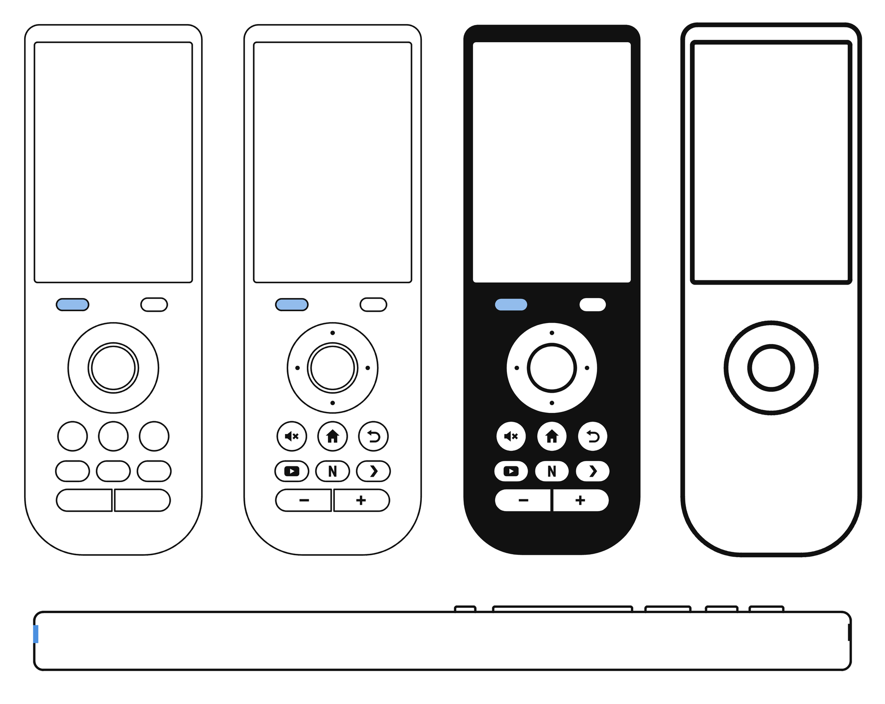
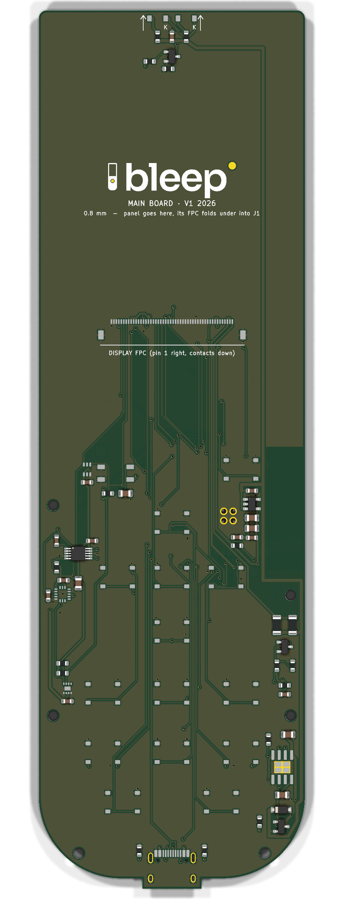

# Bleep

**A DIY touchscreen universal remote.** It's built around an ESP32-S3 on a main board of our own, with a 3.5″ IPS touch display, 14 physical keys, IR send and learn, haptics, and Home Assistant control over Wi-Fi. The case is 3D-printed and only 13 mm thick.

<p align="center">
  
  &nbsp;
  
</p>

## What it is

Most universal remotes either have a screen and few buttons, or lots of buttons and no screen. Bleep has both. The touchscreen shows activities, now-playing and smart-home controls. The keys you use without looking stay physical: a D-pad ring with OK, Back, Home, Mute, three app keys (YouTube, Netflix, Plex) and a volume rocker.

- **IR out**: two side-view 940 nm IR LEDs at the top end control TVs, receivers and boxes.
- **IR learning**: a 38 kHz receiver behind a small window under the screen copies codes from your old remotes.
- **Wi-Fi**: Home Assistant control of lights, scenes and media through the ESP32-S3.
- **Feel**: a coin vibration motor driven by a DRV2605L haptics driver.
- **Smart power**: lift-to-wake (accelerometer), wake on touch or any key, auto-brightness (light sensor), and a fuel gauge for an accurate battery percentage. Asleep it draws about 0.1–0.15 mA, so a charge lasts months.
- **USB-C** for charging and flashing.

The hardware is designed for all of this. The firmware's app and UI run today in an emulator (on the PC or in a browser) while the boards are being made; the ESP32-S3 port comes when they arrive. See [firmware/README.md](firmware/README.md).

The industrial design comes from a concept pack made in Claude Design (design **1b "Pebble"**, in `design/`). The brand (wordmark, logo lockup) comes from the Bleep brand book.

## Status

| Part | State |
|---|---|
| Main board v1 | **Ordered** from JLCPCB on 2026-10-08 (5 boards, 2 assembled). The design is locked: the files in `hardware/mainboard/` are the ones in production. |
| Enclosure | Ready to print. The back plate is flat, with room for a 4.0 × 50 × 85 mm Li-Po (405085) under the screen. |
| Display | BuyDisplay ER-TFT035IPS-6 + capacitive touch, **ordered** 2026-10-09. Its cable fold gets checked on the real panel before assembly. |
| Battery | **Ordered** 2026-10-09 (405085 planned; if the cell differs, set `BATT` in `layout.py` and rebuild the back plate). |
| Firmware | App and UI (C + LVGL 9) running in a PC/browser emulator with 32 scripted test scenarios; ESP-IDF port next. [firmware/](firmware/) |

## Hardware at a glance

| | |
|---|---|
| Size | 60.7 × 182.2 × 13.0 mm |
| MCU | ESP32-S3-WROOM-1-N8R2 (8 MB flash, 2 MB PSRAM), antenna at the right edge beside the D-pad |
| Display | 3.5″ IPS 320 × 480, ILI9488 on an 8-bit parallel bus (much faster than SPI), FT6236 capacitive touch |
| Keys | 14 tactile switches, each on its own wake-capable GPIO |
| IR | 2 × VSMB2948SL LEDs (≈ 125 mA peaks), IRM-H638T receiver for learning |
| Sensors | MMA8452Q accelerometer, LTR-303ALS light sensor, MAX17048 fuel gauge |
| Power | 1-cell Li-Po, TP4056 charger with load sharing, ME6211 3.3 V LDO |
| Board | 2 layers, 0.8 mm, 54 × 178 mm. JLCPCB assembles the top side; you solder the ESP32 module, battery and motor on the underside. |
| Case | PETG, two colours for the key labels (flush inlays), plus translucent blue PETG for the IR and sensor windows (two small separate prints); the board screwed to the front shell (4 × M2×4) and the back plate held by 2 × M2×8 and two snap fingers, all into heat-set inserts |

The parts list, pin map, assembly steps, ordering guide (≈ €130 in total, delivered to Cyprus) and firmware notes are in **[hardware/README.md](hardware/README.md)**.

## How it's built

Everything mechanical comes from one file, [`hardware/layout.py`](hardware/layout.py). It holds the display and part sizes, the key layout, where each part sits, the z stack and the screw points, and it runs fit checks on all of them. Two generators read it:

- **Enclosure**: `layout.py` writes `enclosure/params.scad`, and [`enclosure/remote.scad`](hardware/enclosure/remote.scad) (OpenSCAD) builds the front shell, its two windows, back plate, key caps and label inlays as STLs, plus interference checks.
- **Main board**: [`mainboard/gen_mainboard.py`](hardware/mainboard/gen_mainboard.py) places the parts in KiCad 10 from the same numbers. [Freerouting](https://github.com/freerouting/freerouting) routes it, then the generator adds ground pours, runs DRC and exports Gerbers, BOM and CPL for JLCPCB.

The board and the case can't drift apart. Since the board was ordered, `layout.py` checks every value the board was built from against `mainboard/pcb_lock.json`. It refuses to run if a case change would move one of them.

## Repository layout

```
design/              concept pack (open the .dc.html files in a browser), brand assets, outline drawings
hardware/
  layout.py          the single source of truth for the mechanics
  build.sh           rebuilds everything from layout.py
  enclosure/         OpenSCAD source and the printable STLs (enclosure/stl/)
  mainboard/         KiCad board, generator, routing logs; fab/ = Gerbers, BOM, CPL (locked)
  viewer/            3D colour viewer (three.js) for trying colourways
  docs/              datasheets and renders
HANDOFF.md           current working state, for picking the project up on another machine
```

## Building

```bash
cd hardware
./build.sh enclosure   # STLs, renders and fit checks
./build.sh viewer      # meshes for the 3D viewer (viewer/index.html)
```

You need Python 3 (no extra packages) and OpenSCAD 2021.01 or newer, on the PATH or set with `OPENSCAD=`. The board rebuild (`./build.sh pcb`) also needs KiCad 10 and Freerouting, and it's disabled while v1 is locked.

To open the 3D viewer locally, run `python3 -m http.server -d hardware/viewer 8742` and go to <http://localhost:8742>.

## Roadmap

1. Boards and display arrive: check the display cable fold, solder the underside parts, print the case.
2. Firmware: LVGL UI (activities, now playing, Home Assistant), IR send and learning through the RMT peripheral, deep sleep with key, touch and lift wake.
3. Fixes found on the real hardware go into a v2 board.
